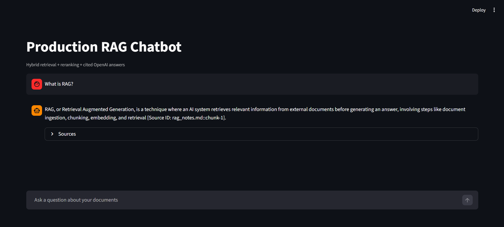

# Enterprise RAG Evaluation Platform

A production-style Retrieval Augmented Generation system focused on reliable retrieval, grounded answers, citations, and automated evaluation.

This project goes beyond a basic RAG chatbot. It implements a full retrieval pipeline with PDF/Markdown ingestion, semantic search, BM25 keyword search, Reciprocal Rank Fusion, cross-encoder reranking, cited OpenAI answer generation, Streamlit UI, and CI-based retrieval quality checks.

## Why This Project Exists

Most beginner RAG demos stop after vector search. That works for simple questions, but it often fails in real systems where users ask about exact terms, document-specific facts, IDs, names, policies, or technical details.

This project is designed around the production problems that make RAG systems harder:

- retrieving the right evidence, not just similar-looking text
- combining semantic search with keyword search
- reranking retrieved chunks before sending them to the LLM
- forcing answers to cite source chunks
- logging traces for debugging
- evaluating retrieval quality with a golden dataset
- failing CI when retrieval quality drops

## Key Features

- Ingests Markdown and PDF documents
- Splits documents into overlapping chunks
- Stores embeddings in ChromaDB
- Builds a BM25 keyword index
- Combines semantic and keyword retrieval with Reciprocal Rank Fusion
- Reranks hybrid candidates with a cross-encoder
- Generates concise cited answers using the OpenAI API
- Provides a Streamlit chatbot interface
- Saves retrieval and answer traces
- Includes a golden retrieval dataset
- Generates an evaluation report and chart
- Runs retrieval evaluation in GitHub Actions

## Architecture

```text
Documents
   |
   v
PDF/Markdown Loaders
   |
   v
Chunking with Overlap
   |
   +--------------------------+
   |                          |
   v                          v
Semantic Embeddings       BM25 Keyword Index
ChromaDB                  Exact-Term Retrieval
   |                          |
   +------------+-------------+
                |
                v
      Reciprocal Rank Fusion
                |
                v
       Cross-Encoder Reranker
                |
                v
       Top Grounding Context
                |
                v
        OpenAI Cited Answer
                |
                v
      Streamlit Chat Interface
```
## Demo




## Tech Stack

- Python
- LangChain
- ChromaDB
- Sentence Transformers
- BM25 with `rank-bm25`
- Cross-encoder reranking
- OpenAI API
- Streamlit
- Matplotlib
- GitHub Actions

## Project Structure

```text
production-rag/
  app.py                # Streamlit chatbot interface
  data/                 # Public sample documents
  src/
    ingest.py           # Loads, chunks, embeds, and indexes documents
    search.py           # Semantic vector search
    bm25_search.py      # BM25 keyword search
    hybrid_search.py    # Semantic + BM25 retrieval with RRF
    rerank_search.py    # Hybrid retrieval + cross-encoder reranking
    rag_pipeline.py     # Main retrieval pipeline with trace logging
    generate_answer.py  # OpenAI final answer generation with citations
    ask.py              # Evidence retrieval helper
  evals/
    golden_dataset.csv  # Golden retrieval questions
    eval_retrieval.py   # Retrieval quality evaluation
    retrieval_report.md # Generated evaluation report
    retrieval_score.png # Evaluation chart
  .github/workflows/
    retrieval-eval.yml  # CI retrieval quality gate
  requirements.txt
  README.md
```

## Setup

Create and activate a virtual environment:

```powershell
python -m venv .venv
.\.venv\Scripts\Activate.ps1
```

Install dependencies:

```powershell
pip install -r requirements.txt
```

Create a `.env` file in the project root:

```text
OPENAI_API_KEY=your_api_key_here
```

The `.env` file is ignored by Git and should never be committed.

## Run The Pipeline

Add `.md` or `.pdf` files to the `data/` folder.

Build the vector database and BM25 index:

```powershell
python src/ingest.py
```

Run the full retrieval pipeline:

```powershell
python src/rag_pipeline.py
```

Generate a final cited answer:

```powershell
python src/generate_answer.py
```

## Streamlit Chatbot

Run the chatbot interface:

```powershell
streamlit run app.py
```

The app lets users ask questions, receive cited answers, and inspect the retrieved source chunks behind each answer.

## Retrieval Modes

### Semantic Search

Uses embeddings and ChromaDB to retrieve chunks that are similar in meaning to the query.

```powershell
python src/search.py
```

### BM25 Keyword Search

Uses exact keyword matching, which helps with names, IDs, acronyms, product codes, and domain-specific terms.

```powershell
python src/bm25_search.py
```

### Hybrid Search

Combines semantic and BM25 results using Reciprocal Rank Fusion.

```powershell
python src/hybrid_search.py
```

### Cross-Encoder Reranking

Reranks the top hybrid candidates by scoring each query/chunk pair more carefully.

```powershell
python src/rerank_search.py
```

## Evaluation

The project includes a small golden retrieval dataset:

```text
evals/golden_dataset.csv
```

The evaluation script checks whether the hybrid + reranked pipeline retrieves the expected source document for each question.

```powershell
python evals/eval_retrieval.py
```

The script prints pass/fail results and exits with an error if the retrieval score drops below `0.80`.

It also writes:

```text
evals/retrieval_report.md
evals/retrieval_score.png
```

## CI Quality Gate

GitHub Actions runs the retrieval evaluation on every push and pull request:

```text
.github/workflows/retrieval-eval.yml
```

If retrieval quality drops below the threshold, the CI workflow fails.

## Citation Strategy

Each chunk stores metadata such as source filename, page number, and chunk ID.

Example source ID:

```text
example.pdf::page-2::chunk-5
```

The final answer prompt requires the model to answer only from retrieved context and cite the source ID for factual claims.

## Cost Controls

The OpenAI answer-generation step is designed to reduce API usage:

- uses a small model
- retrieves a limited number of chunks
- reranks before generation
- sends only the top context to the LLM
- caps answer length

Recommended account settings:

- keep auto recharge off
- use a small initial credit amount
- set project budget alerts
- keep private document data sharing disabled

## Current Limitations

- The golden dataset is intentionally small and should be expanded.
- The current evaluation focuses on retrieval quality, not full answer faithfulness.
- Ragas-based faithfulness and answer relevancy evaluation is planned as a future upgrade.
- Public deployment requires storing the OpenAI API key as a platform secret.

## Future Improvements

- Add Ragas faithfulness and answer relevancy scoring
- Add stricter citation validation
- Expand the golden dataset to 50-200 Q&A pairs
- Deploy the Streamlit app publicly
- Add support for document upload from the UI
